# AIJumpTest 智能考试系统

AIJumpTest 是一个基于 **Spring Boot 3 + Vue 3** 的前后端分离智能考试系统，面向在线题库练习、试卷管理、考试作答、成绩统计和 AI 辅助出题等场景。项目支持学生端在线练习与考试，也提供管理端完成题目、分类、试卷、成绩、排行榜和首页轮播图等业务管理。

项目已接入 DeepSeek 大模型用于 AI 生成题目，并结合 EasyExcel 实现题目批量导入导出。

## 项目亮点

- 前后端分离架构：前端使用 Vue 3 + Element Plus，后端使用 Spring Boot 3 提供 RESTful API。
- 登录鉴权与角色控制：基于 JWT 实现登录态管理，区分管理员和学生角色。
- 完整考试业务闭环：覆盖题库练习、试卷管理、考试作答、自动判分、成绩记录和排行榜。
- AI 辅助出题：接入 DeepSeek API，根据题型、难度、分类等条件生成题目。
- Excel 批量处理：支持题目模板下载、Excel 导入和按筛选条件导出。
- 统一工程规范：包含统一响应结果、全局异常处理、参数校验、MyBatis Plus 分页与复杂查询。
- 接口文档友好：集成 Knife4j / OpenAPI，便于调试和交付接口。

## 技术栈

| 模块 | 技术 |
| --- | --- |
| 前端 | Vue 3、Vue Router、Element Plus、Axios、Vite |
| 后端 | Spring Boot 3、Spring MVC、MyBatis Plus、Spring Validation |
| 数据库 | MySQL |
| 缓存 | Redis |
| 鉴权 | JWT、BCrypt |
| AI 能力 | DeepSeek API |
| 文件处理 | EasyExcel、Aliyun OSS |
| 接口文档 | Knife4j、SpringDoc OpenAPI |
| 构建工具 | Maven、npm |

## 功能模块

### 学生端

- 用户注册、登录、身份识别
- 首页轮播图展示
- 热门题目展示
- 题库分类筛选
- 选择题、判断题、简答题练习
- 在线选择试卷并开始考试
- 考试提交与结果查看
- 历史考试记录查看
- 排行榜查看

### 管理端

- 题目管理：新增、编辑、删除、查询、按题型 / 难度 / 分类筛选
- AI 生成题目：根据配置调用大模型生成题目内容
- Excel 导入导出：下载模板、批量导入题目、导出当前筛选结果
- 分类管理：维护题目分类树
- 试卷管理：手动组卷、编辑试卷、发布 / 下架试卷
- 成绩管理：查看考试记录和成绩数据
- 排行榜管理：查看考试排名
- 轮播图管理：上传图片、维护首页轮播图、控制启用状态

## 项目截图

### 首页

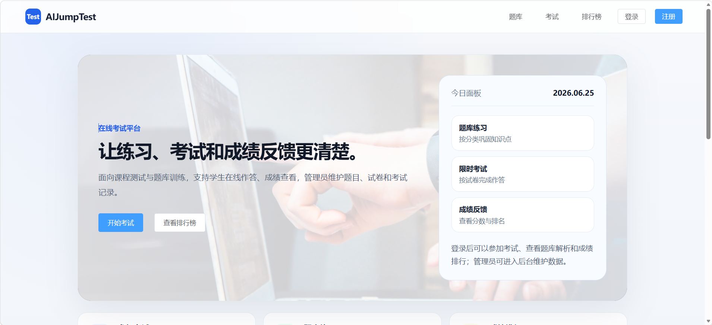

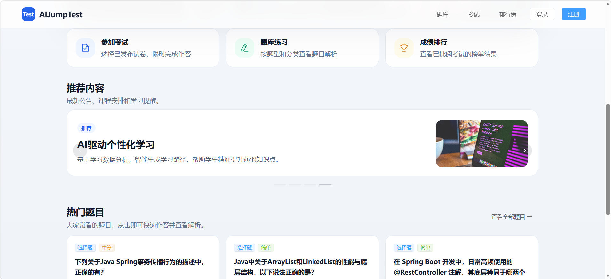

### 登录注册

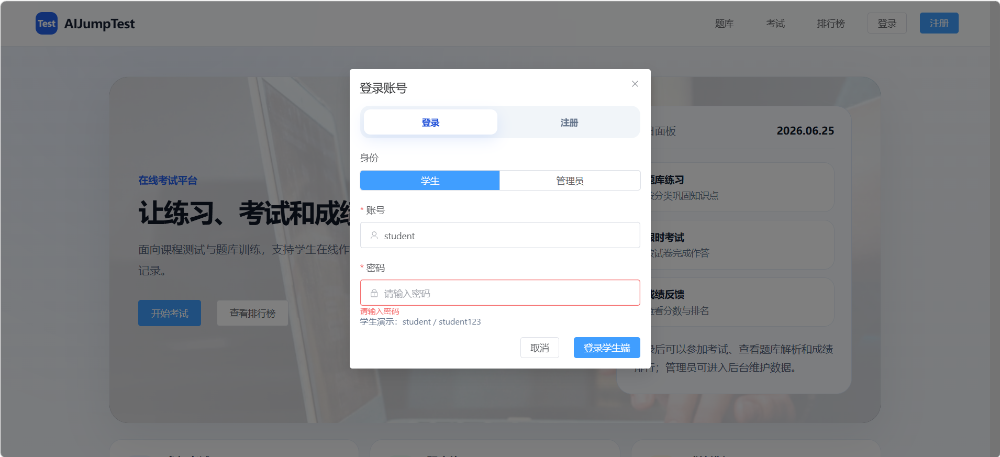

### 学生端题库练习

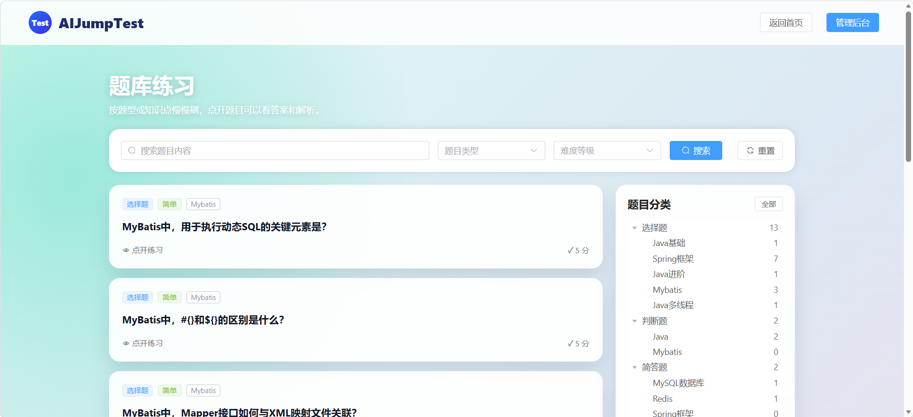

### 题目详情与答题反馈

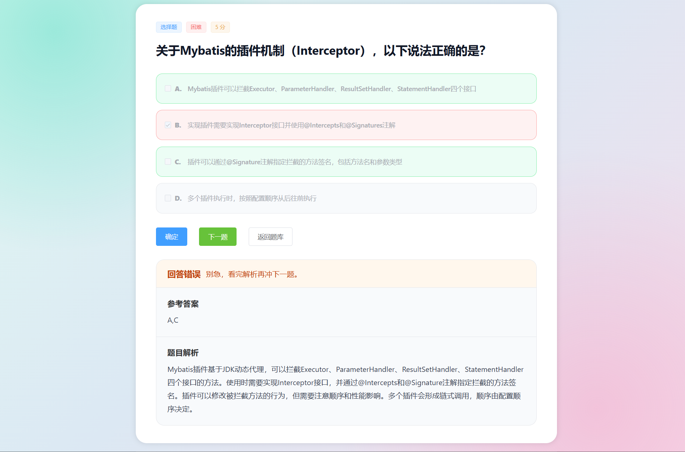

### 在线考试

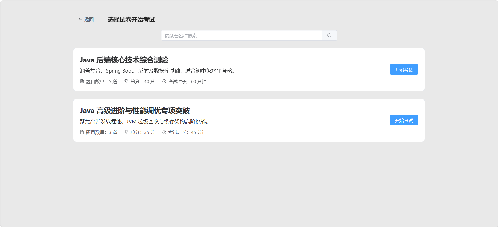

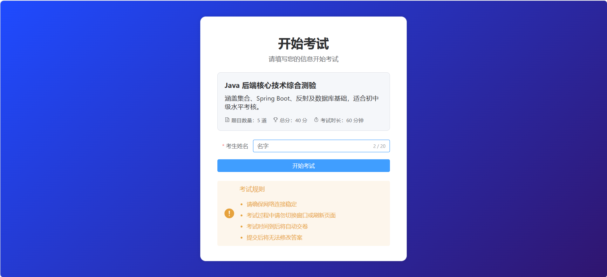

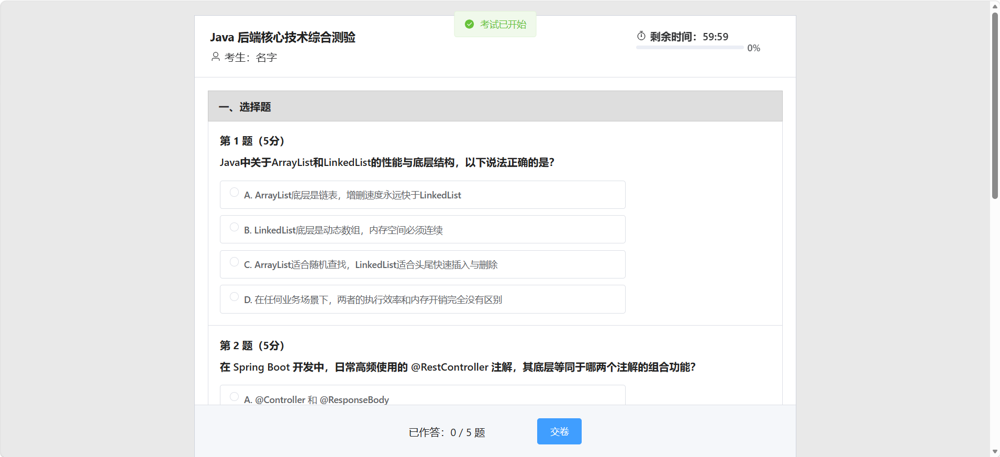

### 考试结果

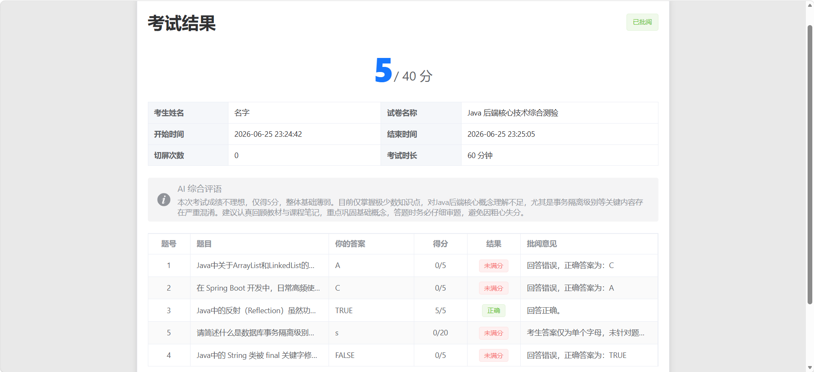

### 排行榜

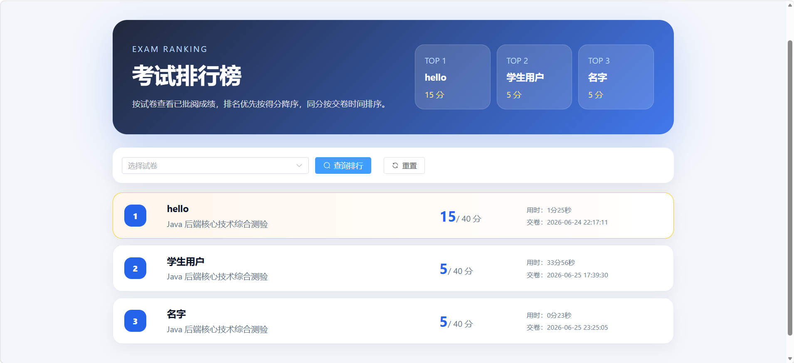

### 管理端题目管理

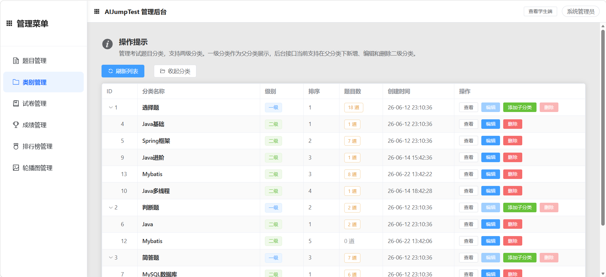

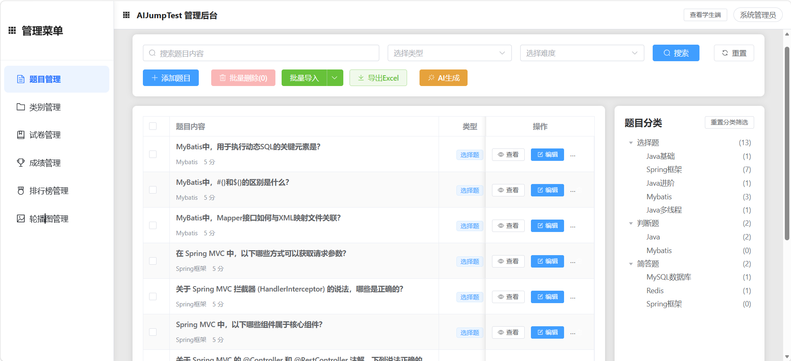

### AI 生成题目

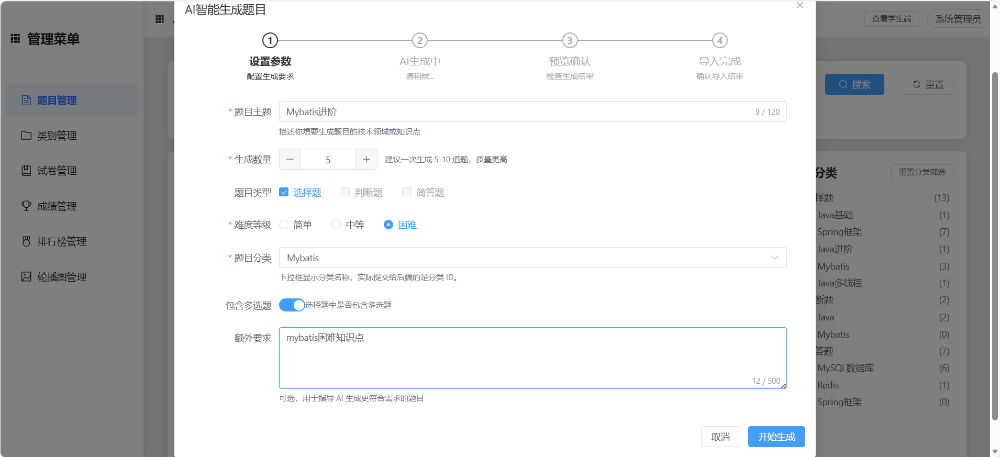

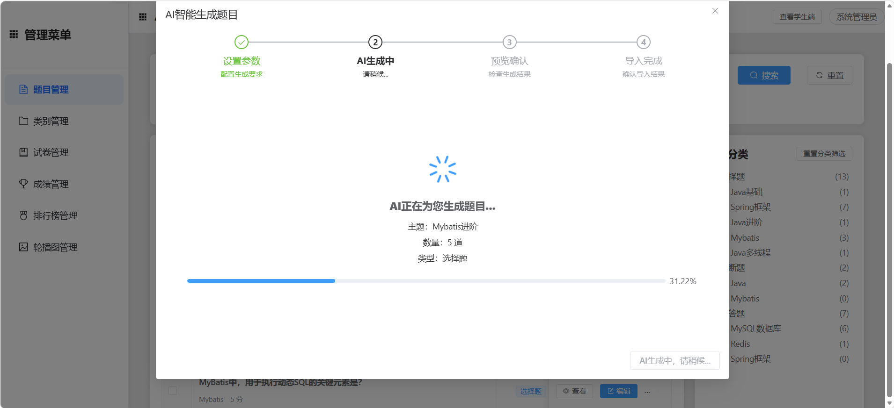

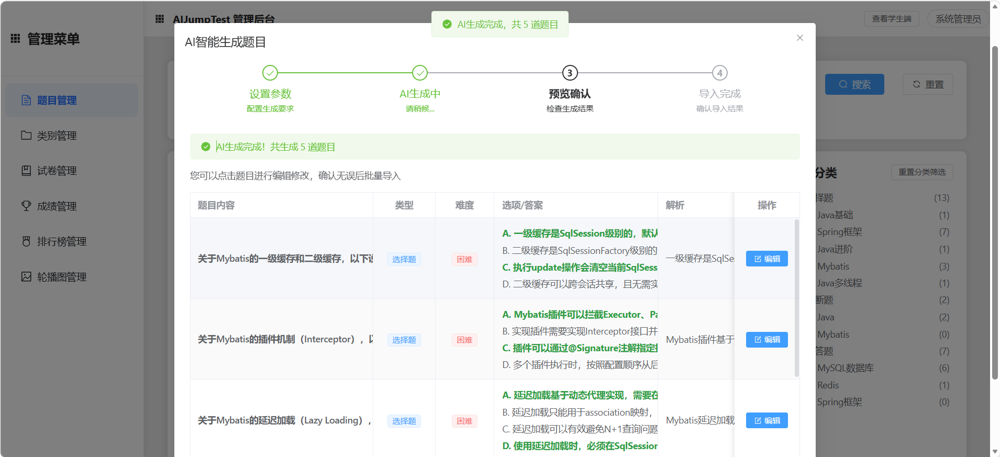

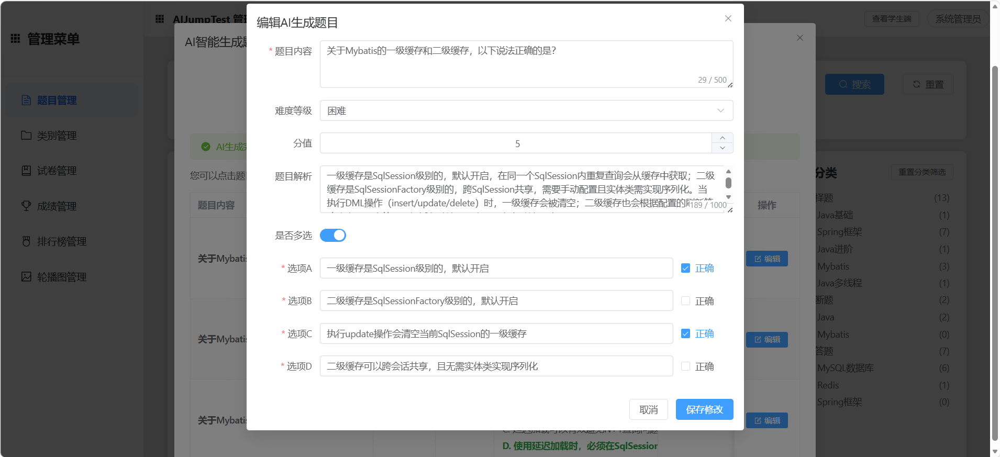

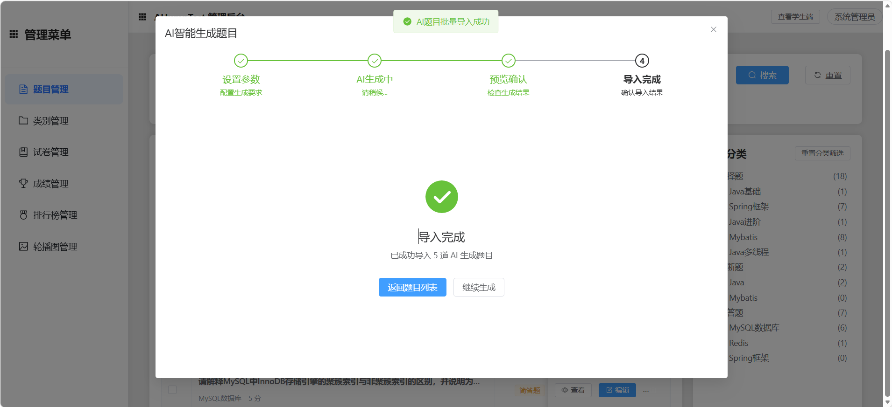

### Excel 导入导出

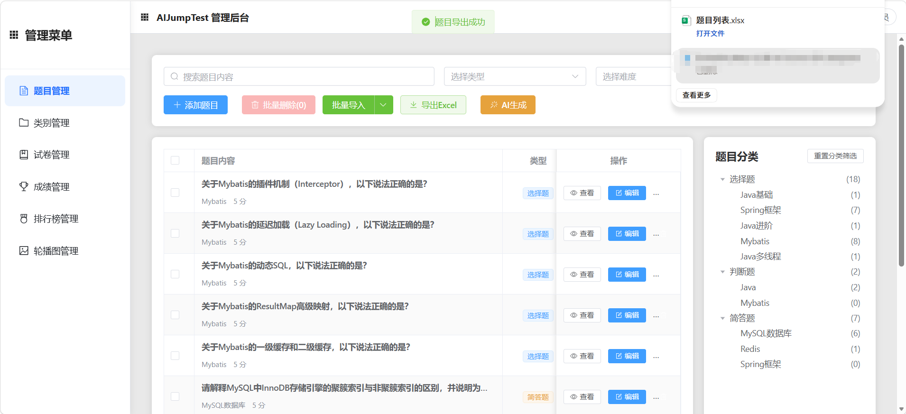

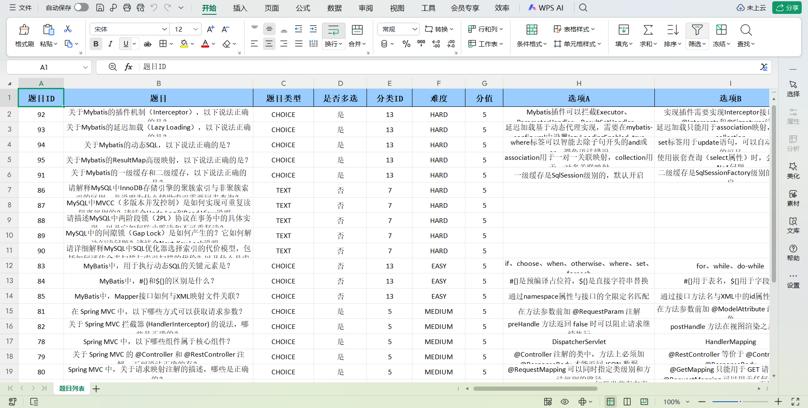

### 试卷管理

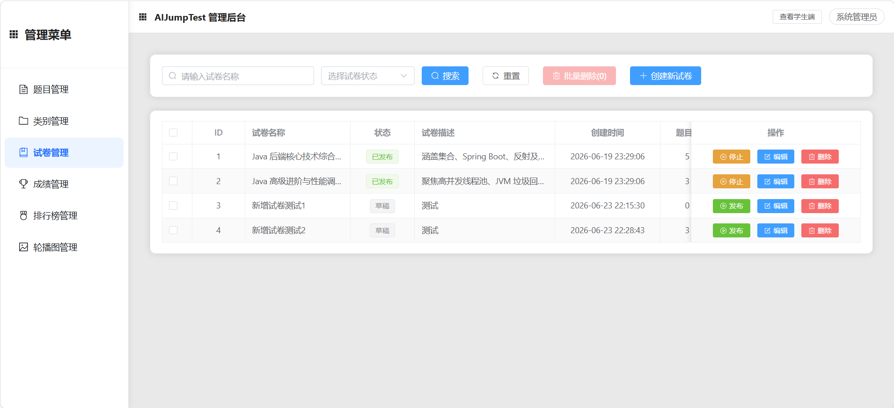

### 成绩管理

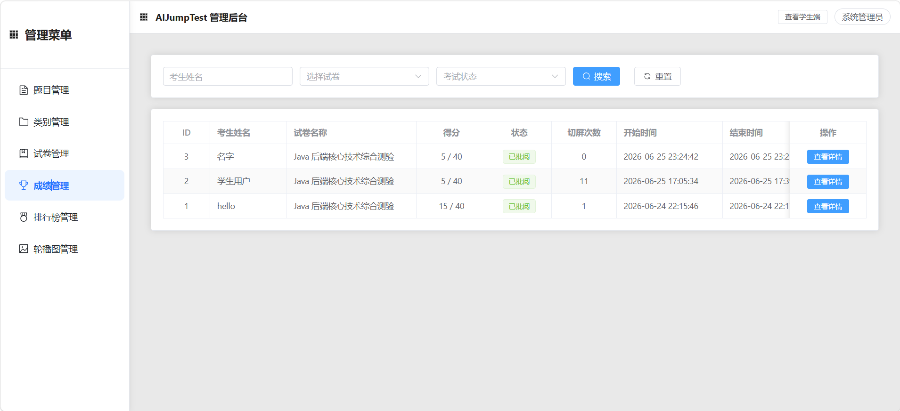

### 轮播图管理

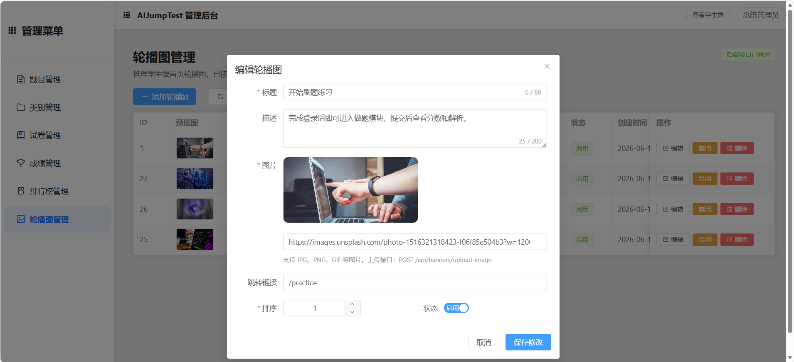

## 目录结构

```text
AIJumpTest
├── backend                         # Spring Boot 后端服务
│   ├── src/main/java/com/achu/aijumptest
│   │   ├── config                  # 配置类
│   │   ├── controller              # REST 接口
│   │   ├── dto                     # 请求参数对象
│   │   ├── entity                  # 数据库实体
│   │   ├── exception               # 全局异常处理
│   │   ├── mapper                  # MyBatis Plus Mapper
│   │   ├── security                # JWT 与登录上下文
│   │   ├── service                 # 业务接口
│   │   ├── service/impl            # 业务实现
│   │   ├── utils                   # 工具类
│   │   └── vo                      # 响应视图对象
│   ├── src/main/resources
│   │   ├── application.yml         # 后端配置
│   │   └── com/achu/aijumptest/mapper
│   └── pom.xml
├── frontend                        # Vue 3 前端项目
│   ├── src
│   │   ├── api                     # 接口请求封装
│   │   ├── components              # 公共组件
│   │   ├── router                  # 前端路由
│   │   ├── utils                   # 前端工具函数
│   │   └── views                   # 页面视图
│   ├── package.json
│   └── vite.config.js
├── sql                             # 数据库初始化脚本
├── docs                            # 项目文档与截图
└── README.md
```

## 环境要求

| 环境 | 建议版本 |
| --- | --- |
| JDK | 17+ |
| Maven | 3.8+ |
| Node.js | 18+ |
| npm | 9+ |
| MySQL | 8.0+ |
| Redis | 6.0+ |

## 本地启动指南

### 1. 克隆项目

```bash
git clone https://github.com/achu123555/AIJumpTest.git
cd AIJumpTest
```

### 2. 初始化数据库

1. 创建数据库：

```sql
CREATE DATABASE ai_jump_test DEFAULT CHARACTER SET utf8mb4 COLLATE utf8mb4_unicode_ci;
```

2. 执行 `sql/` 目录下的初始化脚本。

建议按业务依赖顺序导入，至少包括用户、分类、题目、试卷和考试记录相关表。可以使用 Navicat、DataGrip、MySQL Workbench 或命令行执行。

命令行示例：

```bash
mysql -u root -p ai_jump_test < sql/categories.sql
mysql -u root -p ai_jump_test < sql/questions.sql
mysql -u root -p ai_jump_test < sql/paper.sql
mysql -u root -p ai_jump_test < sql/examRecord.sql
mysql -u root -p ai_jump_test < sql/answerRecord.sql
mysql -u root -p ai_jump_test < sql/banners.sql
mysql -u root -p ai_jump_test < sql/sys_user.sql
```

如果你的 SQL 文件中已经包含建表和初始化数据，也可以直接按实际脚本内容导入。

### 3. 配置后端环境变量

后端配置文件位于：

```text
backend/src/main/resources/application.yml
```

项目中的敏感配置为环境变量读取。启动后端前，需要配置以下变量：

| 环境变量 | 说明 | 示例 |
| --- | --- | --- |
| `MYSQL_URL` | MySQL 连接地址 | `jdbc:mysql://localhost:3306/ai_jump_test?useUnicode=true&characterEncoding=utf-8&serverTimezone=Asia/Shanghai` |
| `MYSQL_USERNAME` | MySQL 用户名 | `root` |
| `MYSQL_PASSWORD` | MySQL 密码 | `123456` |
| `REDIS_HOST` | Redis 地址 | `localhost` |
| `ALIYUN_OSS_ENDPOINT` | 阿里云 OSS endpoint | `https://oss-cn-beijing.aliyuncs.com` |
| `ALIYUN_OSS_BUCKET` | OSS Bucket 名称 | `your-bucket-name` |
| `DEEPSEEK_API_KEY` | DeepSeek API Key | `sk-xxxx` |
| `JWT_SECRET` | JWT 签名密钥，建议至少 32 位 | `AIJumpTest-Your-Secret-At-Least-32-Bytes` |

Windows PowerShell 示例：

```powershell
$env:MYSQL_URL="jdbc:mysql://localhost:3306/ai_jump_test?useUnicode=true&characterEncoding=utf-8&serverTimezone=Asia/Shanghai"
$env:MYSQL_USERNAME="root"
$env:MYSQL_PASSWORD="123456"
$env:REDIS_HOST="localhost"
$env:DEEPSEEK_API_KEY="你的 DeepSeek API Key"
$env:JWT_SECRET="AIJumpTest-Your-Secret-At-Least-32-Bytes"
```

macOS / Linux 示例：

```bash
export MYSQL_URL="jdbc:mysql://localhost:3306/ai_jump_test?useUnicode=true&characterEncoding=utf-8&serverTimezone=Asia/Shanghai"
export MYSQL_USERNAME="root"
export MYSQL_PASSWORD="123456"
export REDIS_HOST="localhost"
export DEEPSEEK_API_KEY="你的 DeepSeek API Key"
export JWT_SECRET="AIJumpTest-Your-Secret-At-Least-32-Bytes"
```

如果暂时不使用 AI 生成题目或 OSS 上传能力，可以先留空对应变量，但相关功能可能不可用。

### 4. 启动 Redis

确保 Redis 服务已经启动，并且 `REDIS_HOST` 指向正确地址。

本地 Redis 示例：

```bash
redis-server
```

Windows 用户如果没有本地 Redis，也可以使用 Docker 启动：

```bash
docker run -d --name redis -p 6379:6379 redis:7
```

### 5. 启动后端

进入后端目录：

```bash
cd backend
mvn spring-boot:run
```

后端默认启动地址：

```text
http://localhost:8080
```

接口文档地址：

```text
http://localhost:8080/doc.html
```

如果 `doc.html` 无法访问，可以尝试：

```text
http://localhost:8080/swagger-ui/index.html
```

### 6. 启动前端

打开新的终端窗口，进入前端目录：

```bash
cd frontend
npm install
npm run dev
```

前端默认启动地址：

```text
http://localhost:3001/home
```

前端开发环境已在 `frontend/vite.config.js` 中配置代理：

```text
/api -> http://localhost:8080
```

因此本地开发时前端请求 `/api/**` 会自动转发到后端服务。

## 常用页面地址

| 页面 | 地址 | 权限 |
| --- | --- | --- |
| 首页 | `/home` | 公开访问 |
| 题库练习 | `/questions` | 学生 / 管理员 |
| 题目详情 | `/question/:id` | 学生 / 管理员 |
| 排行榜 | `/ranking` | 学生 / 管理员 |
| 选择考试 | `/exam/list` | 学生 / 管理员 |
| 开始考试 | `/exam/start/:paperId` | 学生 / 管理员 |
| 考试作答 | `/exam/take/:id` | 学生 / 管理员 |
| 考试结果 | `/exam/result/:id` | 学生 / 管理员 |
| 题目管理 | `/admin/question-manage` | 管理员 |
| 分类管理 | `/admin/category-manage` | 管理员 |
| 试卷管理 | `/admin/paper-manage` | 管理员 |
| 成绩管理 | `/admin/score-manage` | 管理员 |
| 排行榜管理 | `/admin/ranking-manage` | 管理员 |
| 轮播图管理 | `/admin/banner-manage` | 管理员 |

## 核心接口

| 模块 | 接口示例 | 说明 |
| --- | --- | --- |
| 登录注册 | `POST /api/auth/login` | 用户登录 |
| 登录注册 | `POST /api/auth/register` | 学生注册 |
| 登录注册 | `GET /api/auth/me` | 获取当前登录用户 |
| 题目管理 | `GET /api/questions/list` | 分页查询题目 |
| 题目管理 | `POST /api/questions` | 新增题目 |
| 题目管理 | `PUT /api/questions` | 更新题目 |
| 题目管理 | `DELETE /api/questions/{id}` | 删除题目 |
| AI 出题 | `POST /api/questions/ai/generate` | AI 生成题目 |
| Excel | `GET /api/questions/template` | 下载导入模板 |
| Excel | `POST /api/questions/import` | 导入题目 Excel |
| Excel | `GET /api/questions/export` | 导出题目 Excel |
| 分类 | `GET /api/categories/tree` | 查询分类树 |
| 试卷 | `GET /api/papers/list` | 查询试卷列表 |
| 试卷 | `POST /api/papers` | 创建试卷 |
| 试卷 | `PUT /api/papers/{id}` | 更新试卷 |
| 考试 | `GET /api/exam/papers` | 查询可考试卷 |
| 考试 | `POST /api/exam` | 创建考试记录 |
| 考试 | `POST /api/exam/{examRecordId}/submit` | 提交考试 |
| 考试 | `GET /api/exam/records` | 查询考试记录 |
| 考试 | `GET /api/exam/ranking` | 查询排行榜 |
| 轮播图 | `GET /api/banners/list` | 查询轮播图 |
| 轮播图 | `POST /api/banners/upload-image` | 上传轮播图图片 |

完整接口请以后端启动后的 Knife4j 文档为准。

## 数据库说明

`sql/` 目录保存了项目主要数据表脚本：

```text
sql
├── answerRecord.sql
├── banners.sql
├── categories.sql
├── examRecord.sql
├── paper.sql
├── questions.sql
└── sys_user.sql
```

主要业务表包括：

| 表 | 说明 |
| --- | --- |
| `sys_user` | 用户表，区分管理员和学生 |
| `categories` | 题目分类表 |
| `questions` | 题目主表 |
| `paper` | 试卷表 |
| `examRecord` | 考试记录表 |
| `answerRecord` | 答题记录表 |
| `banners` | 首页轮播图表 |

## 测试账号

请根据你的 `sql/sys_user.sql` 初始化数据填写测试账号。

| 角色 | 用户名 | 密码 | 说明 |
| --- | --- | --- | --- |
| 管理员 | `请填写` | `请填写` | 可访问管理端 |
| 学生 | `请填写` | `请填写` | 可访问学生端 |

> 注意：如果数据库中保存的是 BCrypt 加密后的密码，请在这里填写用户实际登录时输入的明文密码，不要填写数据库密文。

## 开发说明

### 前端构建

```bash
cd frontend
npm run build
```

构建产物默认生成在：

```text
frontend/dist
```

### 后端测试

```bash
cd backend
mvn test
```

### 后端打包

```bash
cd backend
mvn clean package
```

## 常见问题

### 1. 前端请求接口失败

请确认后端已经启动，并且前端代理目标为：

```text
http://localhost:8080
```

对应配置位于：

```text
frontend/vite.config.js
```

### 2. 后端启动时数据库连接失败

请检查：

- MySQL 是否已启动
- 数据库 `ai_jump_test` 是否已创建
- `MYSQL_URL`、`MYSQL_USERNAME`、`MYSQL_PASSWORD` 是否配置正确
- SQL 脚本是否已成功导入

### 3. 登录后无法访问管理端

请检查当前用户角色是否为 `ADMIN`。学生账号只能访问学生端功能。

### 4. AI 生成题目不可用

请检查：

- `DEEPSEEK_API_KEY` 是否配置
- 网络是否能访问 DeepSeek API
- 后端日志中是否有模型调用错误信息

### 5. 图片上传不可用

请检查：

- OSS endpoint 和 bucket 是否配置正确
- OSS 访问凭证是否在运行环境中正确配置
- bucket 权限和跨域配置是否允许访问

## 后续优化方向

- 增加更多单元测试和接口测试，提高核心业务稳定性。
- 使用 Docker Compose 编排 MySQL、Redis、后端和前端，实现一键启动。
- 增加 GitHub Actions，自动执行前端构建和后端测试。
- 完善管理端数据统计图表，例如题目数量、考试参与人数、平均分趋势。
- 优化 AI 出题提示词，支持按知识点、题型比例和难度分布批量生成。
- 增加错题本、收藏题目、考试倒计时防作弊等学生端能力。

## 作者

- GitHub: [achu123555](https://github.com/achu123555)
- 项目地址: [AIJumpTest](https://github.com/achu123555/AIJumpTest)

## License

本项目仅用于学习、实习项目展示和技术交流。如需用于生产环境，请进一步完善权限、安全、日志、监控和部署配置。
